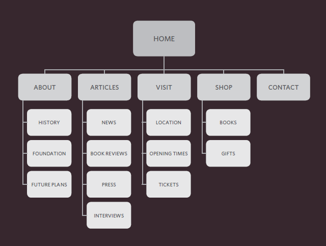
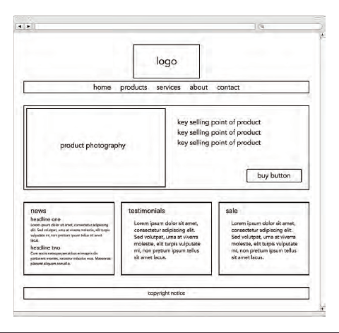

# Process & Design
befor your starting design you chould ask your self some questions
## Who is the Site For?
* What is the age range of your target audience?
* Will your site appeal to more women or men? What is the mix?
* Which country do your visitors live in?
* Do they live in urban or rural areas?
* What is the average income of visitors?
* What level of education do they have?
* What is their marital or family status?
* What is their occupation?
* How many hours do they work per week?
* How often do they use the web?
* What kind of device do they use to access the web?
## Why People Visit YOUR Website?
* Are they looking for general entertainment or do they need to achieve a specific goal?
* If there is a specific goal, is it a personal or professional one?
* Do they see spending time on this activity as essential or a luxury?
## What Information Your Visitors Need?
* Will visitors be familiar with your subject area / brand or do you need to introduce yourself?
* Will they be familiar with the product / service / information you are covering or do they need background information on it?
* What are the most important features of what you are offering?
* What is special about what you offer that differentiates you from other sites that offer something similar?
* Once people have achieved the goal that sent them to your site, are there common questions people ask about this subject area?
## How Of ten People Will Visit Your Site?
* How often do the same people return to purchase from you?
* How often is your stock updated or your service changed?
* How often is the subject updated?
* What percentage of your visitors would return for regular updates on the subject, compared with those who will just need the information once?

Now that you know what needs to appear on your site, you can start to organize the information into sections or pages.
# Site Maps
The aim is to create a diagram of the pages that will be used to structure the site. This is known as a site map and it will show how those pages can be grouped.
To help you decide what information should go on each page, you can use a technique called card sorting.

` site maps example `
# WireFrames
A wireframe is a simple sketch of the key
information that needs to go on each page of a
site. It shows the hierarchy of the information
and how much space it might require.

` WireFrames `
# HTML5 specifications 
1. The new HTML5 elements i XX ndicate the purpose of different parts of a web page and help to describe its structure.
2. The new elements provide clearer code (compared
with using multiple 
 elements).
3.  Older browsers that do not understand HTML5
elements need to be told which elements are
block-level elements.
4. To make HTML5 elements work in Internet Explorer 8
(and older versions of IE), extra JavaScript is needed,
which is available free from Google.
