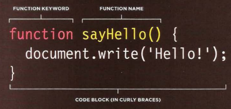
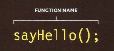

Before you learn how to read and write the JavaScript
language itself, you need to become familiar with some key
concepts in computer programming. They will be covered in
three sections: 
1. What is a script and how do I creat one ?
2.  How do computers fit in with the world around them?
3. How do I write a script for a web page? 

### scribt
A script is a series of instructions that a
computer can follow to achieve a goal. 

### coding start 
When i want to starting code I need to :
1. DEFINE THE GOAL
2. DESIGN THE SCRIPT
3. FINALY I CODE EACH STEP


## Rules for naming variables 
1. The name must begin with
a letter, dollar sign ($),or an
underscore (_).
2. The name can contain letters,
numbers, dollar sign ($), or an
underscore (_).
3. You cannot use keywords or
reserved words .
4. All variables are case sensitive .
5. Use a name that describes the
kind of information that the
variable stores. (optinal)
6. If your variable name is made
up of more than one word, use a
capital letter for the first letter of
every word after the first word.(optinal)

## ARRAYS
An array is a special type of variable. It doesn't
just store one value; it stores a list of values.

You create an array and give it
a name just like you would any
other variable (using the var
keyword followed by the name of
the array). 
```
var colors;
colors ['white', 'black', ' custom'];
var el document.getElementByld('col ors');
el . textContent = col ors[O];
```
Each item in an array is
automatically given a number
called an index.  `it is start frome zero not one `
#### there are many operators such as:
* ASSIGNMENT OPERATORS
* ARITHMETIC OPERATORS
* STRING OPERATORS
* COMPARISON OPERATORS
* LOGICAL OPERATORS

## Functions 
Functions let you group a series of statements together to perform a
specific task. If different parts of a script repeat the same task, you can
reuse the function (rather than repeating the same set of statements). 
### **decliring a function:**

### **Calling a function**

