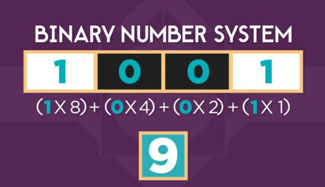
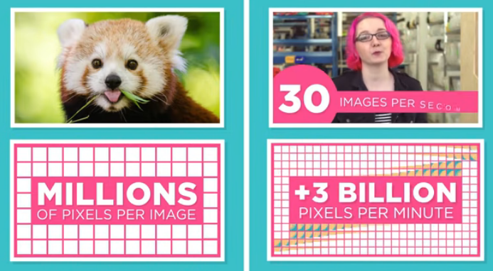

## What makes a computer a computer?
* [Input](https://www.unm.edu/~tbeach/terms/inputoutput.html)

`it is convert a physical input to binary informations` 
* [Storage](https://en.wikipedia.org/wiki/Computer_data_storage)

`inserting the information inside the memory`
* [Processing](https://www.dummies.com/computers/computer-networking/networking-components/computer-processing/)

`using algorithems to do some process`
* [Output](https://www.unm.edu/~tbeach/terms/inputoutput.html)

`convert informations to physical output`

## How does computer work 
in first of all you should understand some wordes
### bit :
smallest information in computer (it can be 0 or 1) .
### the binary number system
in the system we have just a two digit (0,1)

#### but how we can represents the numbers?
we should convert it like this

#### how the textes are represents?

every single letter will represint by a number
### how the photos and videos are represents?
in the photos and videos all of pixels will be rersent as a binary number

### finally how the sounds are represents
A sound is a group of vibrations expressed as numbers and soo on 

# ciruits
there are more types of circuits like
* not
* and
* or 
* xor
* adder and soo on

[for more information](https://jennysonline.blogspot.com/2020/11/logic-design-digital-computer-circuits.html#:~:text=Logic%20Design%20%26%20Digital%20Computer%20Circuits.%20Logic%20Design,conditions%3B%20algorithmic%20state%20machines%3B%20design%20of%20digital%20subsystems.)
# Hardware
# Software

## CPU 
MASTER chip that controls all other parts of the computer

## operating system
the master program that manages how software uses the hardware of a computer 