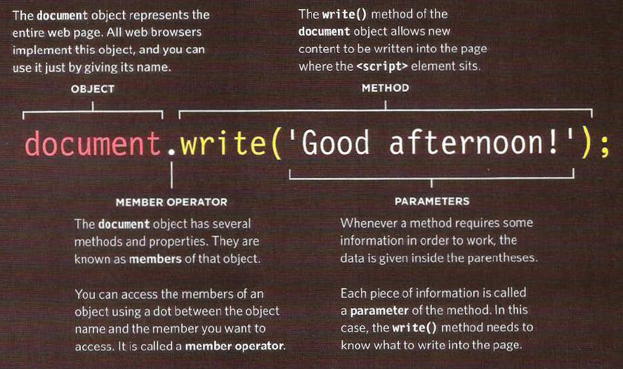
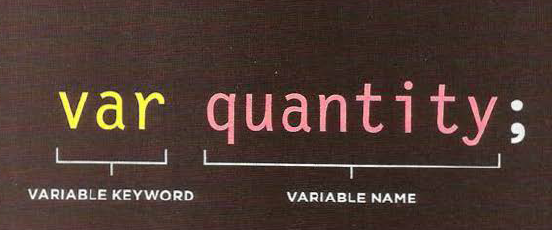
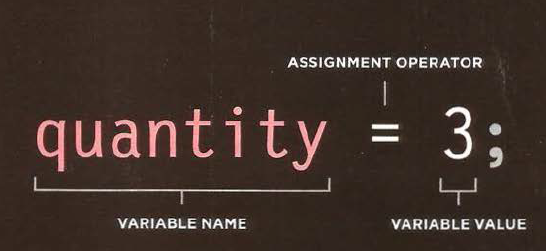

[steps](https://mohammadabuhatab.github.io/Reading-04c/)
# HTML `(CONTENT LAYER)`
This is where the content of the page lives. The HTML gives the page structure and adds semantics.

# CSS `(PRESENTATION LAYER)`
The CSS enhances the HTML page with rules that state how the HTML content is presented (backgrounds, borders, box dimensions, colors, fonts, etc.).

# JS `(BEHAVIOR LAYER)`
This is where we can change how the page behaves, adding interact ivity. We will aim to keep as much of our JavaScript as possible in separate files.
## comments befor using layers
* It is best to keep JavaScript code in its own JavaScript
file. JavaScript files are text files (like HTML pages and
CSS style sheets), but they have the . j s extension.
* The HTML` <script> element is used in HTML pages`
to tell the browser to load the JavaScript file (rather like
the `<link>` element can be used to load a CSS file).
* If you view the source code of the page in the browser,
the JavaScript will not have changed the HTML,
because the script works with the model of the web
page that the browser has created.
## to call a function 

# STATEMENTS
A script is a series of instructions that a computer can follow one-by-one. Each individual instruction or step is known as a statement. Statements should end with a semicolon `(;)`.
# COMMENTS
You should write comments to explain what your code does. They help make your code easier to read and understand. This can help you and others who read your code.
# VARIABLS 
we can say its like container i can but any value in it .
## DECLARE

## ASSING A VALUE

## RULES FOR NAMING VARIABLES
1. The name must begin with a letter, dollar sign ($),or an underscore (_). It must not start with a number.
2. The name can contain letters, numbers, dollar sign ($), or an underscore (_). Note that you must not use a dash(-) or a period (.) in a variable name.

3. You cannot use keywords or reserved words. Keywords are special words that tell the interpreter to do something. For example, var is a keyword used to declare a variable. Reserved words are ones that may be used in a future version of JavaScript.

4. All variables are case sensitive, so score and Score would be different variable names, but it is bad practice to create two variables that have the same name using different cases.

5. Use a name that describes the kind of information that the variable stores. For example, fi rstName might be used to store a person's first name, l astNarne for their last name, and age for their age.

6. If your variable name is made up of more than one word, use a capital letter for the first letter of every word after the first word. For example, f i rstName rather than fi rstnarne (this is referred to as camel case). You can alsouse an underscore between each word (you cannot use a dash).
